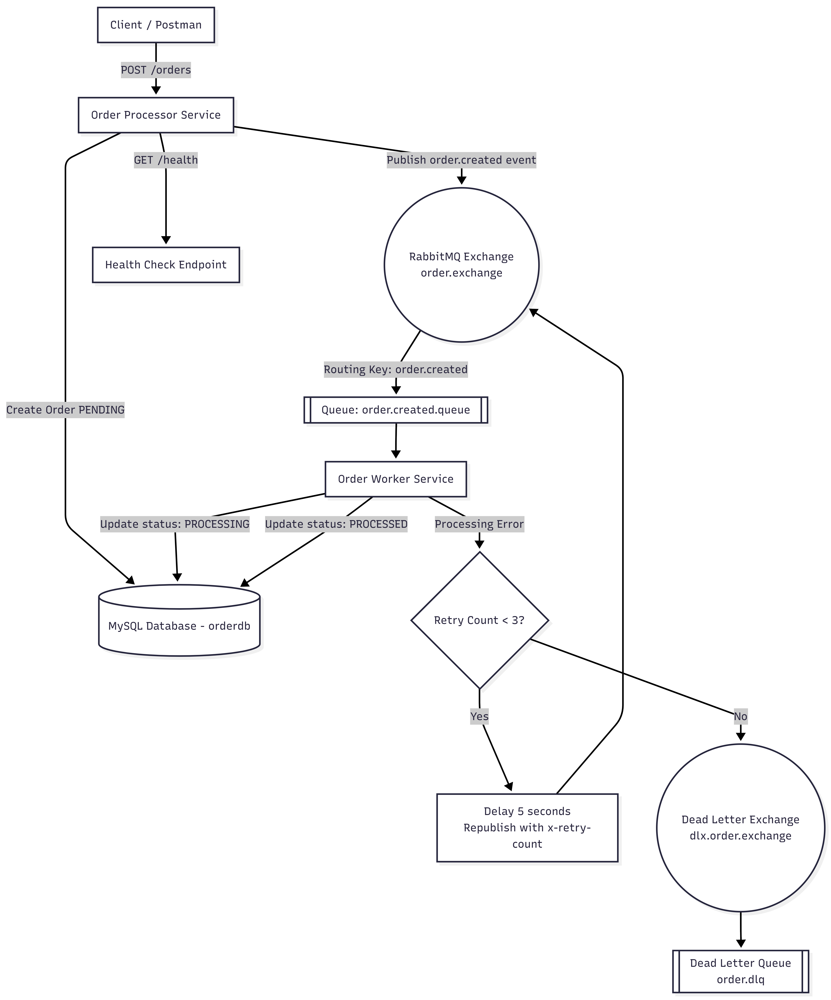

# Event-Driven Order Fulfillment Service

A fully Dockerized **Event-Driven Microservices Architecture** built using:

* Node.js  
* Express  
* MySQL  
* RabbitMQ  
* Docker & Docker Compose  

This project demonstrates reliable asynchronous order processing using:

* Message Queues  
* Retry Strategy  
* Dead Letter Queue (DLQ)  
* Health Monitoring  
* Idempotent Workers  

---

# Project Overview

This system simulates a real-world order processing workflow using an event-driven design.

### Flow Summary:

1. Client creates an order via REST API.  
2. Order Processor:  
   * Stores order in MySQL (`PENDING`)  
   * Publishes `order.created` event to RabbitMQ  
3. Order Worker:  
   * Consumes event  
   * Updates order status → `PROCESSING`  
   * Processes order  
   * Updates status → `PROCESSED`  
4. On failure:  
   * Retries up to 3 times  
   * After 3 failures → sends message to Dead Letter Queue  

---

# Architecture Diagram

## System Architecture

`[Looks like the result wasn't safe to show. Let's switch things up and try something else!]`

---
## Architecture



---

# Tech Stack

| Layer              | Technology                 |
| ------------------ | -------------------------- |
| Backend            | Node.js + Express          |
| Database           | MySQL 8                    |
| ORM                | Sequelize                  |
| Message Broker     | RabbitMQ                   |
| Containerization   | Docker + Docker Compose    |
| Architecture Style | Event-Driven Microservices |

---

# Project Structure

```
event-driven-order-fulfillment-service/
│
├── order-processor-service/
│   ├── src/
│   │   ├── routes/
│   │   ├── services/
│   │   ├── publishers/
│   │   ├── rabbitmq/
│   │   ├── config/
│   │   ├── models/
│   │   └── app.js
│   └── Dockerfile
│
├── order-worker-service/
│   ├── src/
│   │   ├── consumers/
│   │   ├── rabbitmq/
│   │   ├── config/
│   │   ├── models/
│   │   └── app.js
│   └── Dockerfile
│
├── docker-compose.yml
├── docs/
│   └── architecture.png
└── README.md
```

---

# How to Run the Project

## Prerequisites

* Docker Desktop installed  
* Git installed  

---

## Clone Repository

```bash
git clone <your-repository-url>
cd event-driven-order-fulfillment-service
```

---

## Build and Start Services

```bash
docker-compose up --build
```

Or run in background:

```bash
docker-compose up -d --build
```

---

# Verify Containers

```bash
docker ps
```

You should see:

* order-processor-service  
* order-worker-service  
* mysql-db  
* rabbitmq  

---

# Health Check

```bash
curl http://localhost:8080/health
```

Expected response:

```json
{
  "status": "UP"
}
```

---

# Create Order (Successful Case)

```bash
curl -X POST http://localhost:8080/orders \
-H "Content-Type: application/json" \
-d '{"productId":"1","customerId":"101","quantity":2}'
```

Worker logs should show:

```
Order processed: <order-id>
```

---

# Retry Logic Test (Failure Case)

Use `productId = 999` to simulate failure:

```bash
curl -X POST http://localhost:8080/orders \
-H "Content-Type: application/json" \
-d '{"productId":"999","customerId":"101","quantity":2}'
```

Worker logs:

```
Retrying message. Attempt 1
Retrying message. Attempt 2
Retrying message. Attempt 3
Max retries reached. Sending to DLQ.
```

---

# Dead Letter Queue Verification

Open RabbitMQ UI:

```
http://localhost:15672
```

Login:

```
Username: guest
Password: guest
```

Go to:  
Queues → `order.dlq`  

You will see failed messages stored there.

---

# Database Verification

Enter MySQL container:

```bash
docker exec -it event-driven-order-fulfillment-service-mysql-db-1 mysql -u user -p
```

Then:

```sql
USE orderdb;
SHOW TABLES;
SELECT id, status FROM Orders;
```

You will see:

* PROCESSED orders  
* Orders retried / failed  

---

# Stop Services

```bash
docker-compose down
```

Reset database completely:

```bash
docker-compose down -v
```

---
